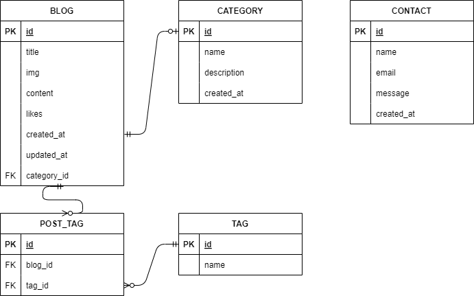
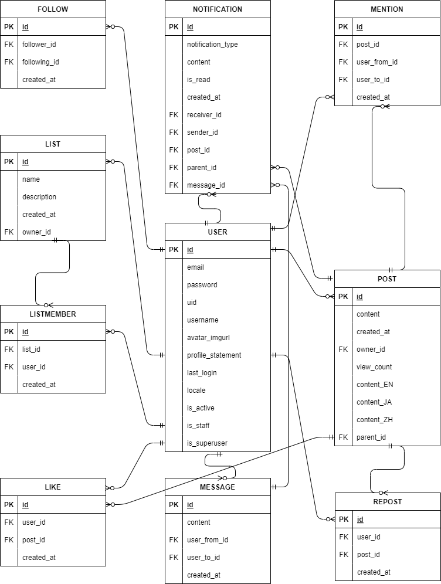

フロントエンドのリポジトリです。バックエンドのリポジトリは<a href=https://github.com/sanmamama/portfolio_backend>こちら</a>です。  

# ポートフォリオサイト　-　ブログ/SNSアプリ
　

## アプリ概要
**ブログアプリ**  
一般的なブログアプリで記事の投稿・閲覧・編集・削除の基本的な機能を持ちます。自身のプロフィールや学習記録、技術的な記事の発信のために開発しました。

代表的な機能  
- Markdownサポートの記事投稿・編集機能(Django Admin使用)  
- 記事をカテゴリーやタグで分類し、整理するカテゴリー・タグ機能  
- ユーザーがブログ内の記事をキーワードで検索できる機能  

**SNSアプリ**  
多言語対応のSNSプラットフォームアプリです。ユーザーが投稿する内容を、DeepL APIを使用して自動的に複数の言語に翻訳し、他言語のユーザーにもシームレスに共有できるSNSアプリを開発しました。  

代表的な機能    
- 投稿作成時にDeepLを使って自動翻訳された内容をプレビュー  
- 翻訳された投稿に対するコメントやリプライも、自動的に投稿者の言語に翻訳  
- 言語選択機能によりユーザーが希望する言語（英語と日本語のみ対応）でフィードを閲覧可能  

## アプリURL:  
**ブログアプリ**  
[https://www.sanmamama.com/](https://www.sanmamama.com/)  

**SNSアプリ**  
[https://www.sanmamama.com/postter](https://www.sanmamama.com/postter)  

## 主な機能の使い方
**ブログアプリ**

|        **記事の閲覧**        |         **記事の検索**          |      **カテゴリ等別一覧表示機能**       |
|:---------------------------:|:--------------------------:|:---------------------------:|
|  |  |  |

**SNSアプリ**  
|        **ポスト機能**        |         **言語切替機能**          |      **メッセージ機能**       |
|:---------------------------:|:--------------------------:|:---------------------------:|
|  |  |  |

## その他機能一覧  
**ブログアプリ**  
- 記事投稿機能(編集・削除含む)
- 記事検索機能
- カテゴリ・タグ・時系列アーカイブ別一覧表示機能
- 記事のいいね機能
- 問い合わせ機能

**SNSアプリ**  
- ログイン機能
- プロフィール編集機能
- ポスト機能(編集・削除含む)
- 言語切替機能
- ポスト検索機能
- メッセージ機能
- リスト機能
- フォロー機能
- ポストいいね機能
- リポスト機能
- リプライ機能
- 通知機能

## ER図
**ブログアプリ**    
    
  
**SNSアプリ**    
    

## インフラ構成図

## 主な使用技術
| カテゴリー | 使用技術 | 
|:-----------|:------------|
| フロントエンド | React18.3.1, HTML/CSS, JavaScript | 
| バックエンド | Django5.0.6, Python3.12.4 |
| データベース | postgreSQL |
| CI / CD | GitHub Actions |
| インフラ | VPS(Ubuntu) / Nginx / Gunicorn / Certbot |
| 環境構築 | Docker / Docker Compose |

