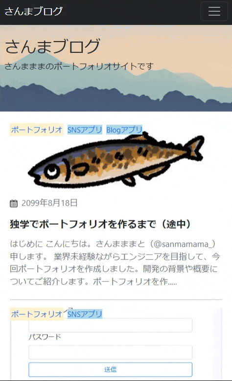
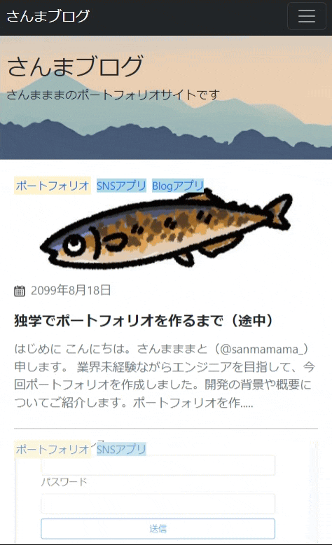
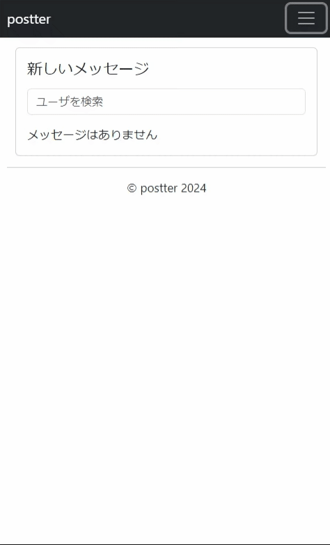
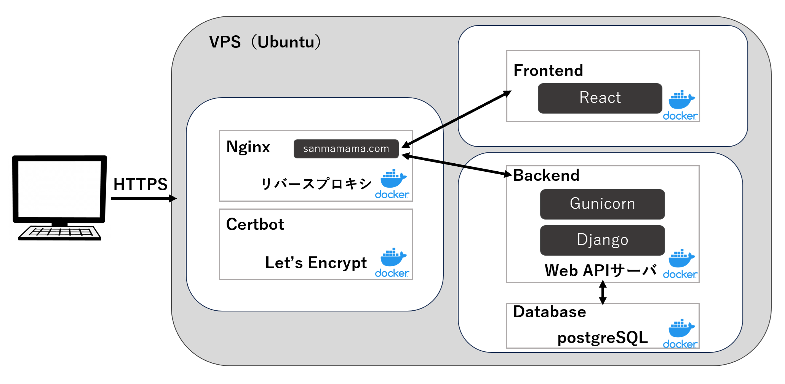

フロントエンドのリポジトリです。バックエンドのリポジトリは<a href=https://github.com/sanmamama/rest>こちら</a>です。  

# ポートフォリオサイト　-　ブログ/SNSアプリ
　

## アプリ概要
**ブログアプリ**  
一般的なブログアプリで記事の投稿・閲覧・編集・削除の基本的な機能を持ちます。自身のプロフィールや学習記録、技術的な記事の発信のために開発しました。

代表的な機能  
- Markdownサポートの記事投稿・編集機能(Django Admin使用)  
- 記事をカテゴリーやタグで分類し、整理するカテゴリー・タグ機能  
- ユーザーがブログ内の記事をキーワードで検索できる機能  

**SNSアプリ**  
多言語対応のSNSプラットフォームアプリです。ユーザーが投稿する内容を、DeepL APIを使用して自動的に複数の言語に翻訳し、他言語のユーザーにもシームレスに共有できるSNSアプリを開発しました。  

代表的な機能    
- 投稿作成時にDeepLを使って自動翻訳された内容をプレビュー  
- 翻訳された投稿に対するコメントやリプライも、自動的に投稿者の言語に翻訳  
- 言語選択機能によりユーザーが希望する言語（英語と日本語のみ対応）でフィードを閲覧可能  

## アプリURL:  
**ブログアプリ**  
[https://www.sanmamama.com/](https://www.sanmamama.com/)  

**SNSアプリ**  
[https://www.sanmamama.com/postter](https://www.sanmamama.com/postter)  

## 主な機能の使い方
**ブログアプリ**

|        **記事の閲覧**        |         **記事の検索**          |      **カテゴリ等別一覧表示機能**       |
|:---------------------------:|:--------------------------:|:---------------------------:|
|  |  |  |

**SNSアプリ**  
|        **ポスト機能**        |         **言語切替機能**          |      **メッセージ機能**       |
|:---------------------------:|:--------------------------:|:---------------------------:|
|  |  |  |

## その他機能一覧  
**ブログアプリ**  
- 記事投稿機能(編集・削除含む)
- 記事検索機能
- カテゴリ・タグ・時系列アーカイブ別一覧表示機能
- 記事のいいね機能
- 問い合わせ機能

**SNSアプリ**  
- ログイン機能
- プロフィール編集機能
- ポスト機能(編集・削除含む)
- 言語切替機能
- ポスト検索機能
- メッセージ機能
- リスト機能
- フォロー機能
- ポストいいね機能
- リポスト機能
- リプライ機能
- 通知機能

## ER図

## インフラ構成図

## 主な使用技術
| カテゴリー | 使用技術 | 
|:-----------|:------------|
| フロントエンド | React18.3.1, HTML/CSS, JavaScript | 
| バックエンド | Django5.0.6, Python3.12.4 |
| データベース | SQLite |
| CI / CD | GitHub Actions |
| インフラ | VPS(Ubuntu) / Nginx / Gunicorn / Certbot |

## 開発背景
### 概要
**ブログアプリ**  
企業に自分のスキルを知ってもらい、技術力をPRするツールとしてブログアプリが最適な形式だと考え、アプリの開発を進めました。

**SNSアプリ**  
グローバルなSNSの可能性を探求するため、既存のXアプリを基にしたSNSアプリを開発しました。言語の壁を超え、全てのポストが自分の言語に翻訳されて表示される仕組みを取り入れることで、
より広範なコミュニケーションが可能になると考えました。このアイデアを実現するために、SNSアプリの特化を行いました。

### 課題
- 一人暮らしであり、自炊等で料理をする機会から必然的に献立を考えざるを得なくなることが多くなる
- ただ、献立を考える際に料理アプリで検索しても自分の難易度に合わないレシピを含めた沢山のものが出てきて、情報量が多くなってしまいがち
- よって献立をどうするか悩みやすく、決める手間というのは想像以上に多い
- そのようなことから料理自体が面倒になり、結果的に外食で済ますことや惣菜を買うといったことがあり、食費がかさんでしまうことに悩んでいる

### 解決方法
自分の作成経験のあるレシピ内で探すなど、あえて情報量を少なくして献立を考える手間を省く

## 工夫した点

  
1.配列を活用した食材リストの一括操作

  
  - 食材を追加や編集を行う際に一つずつデータ処理するのではなく、配列を用いて一気に食材リストを登録や更新できるようにしました

  
2.直感的に操作

  
  - ヘッダーに他のサイトなどでもよく見かけるアイコンを用いる等のことを行い直感的に操作できるようにしました

  
3.手軽に献立を検索するコンセプト

  
  - ログイン直後のページで登録した自分のレシピの表示やすぐに検索をできるようにと、手軽に献立を検索するコンセプトに沿うようにしました。

  
4.女性好みのデザイン配色

  
  - デザイン面でミントグリーンやオレンジ色などを使って、雰囲気を柔らかく女性の好みにも合致しやすいように配色を寄せました。

